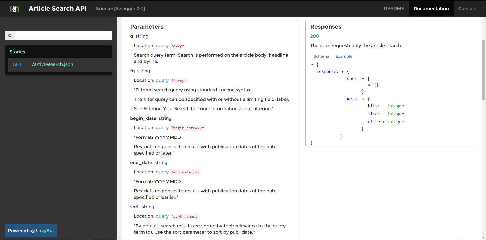

* **Instructions - Phase 1:**

##Front-End Team:

  * Create the layout for the design above. Feel free to use Bootstrap or to do something more customized of your own.

  * Make sure to organize your code so as to have the necessary IDs. 

  * Incorporate text boxes for capturing User Input. Then research how to retrieve the input values in Javascript 

##Back-End Team:

  * Do preliminary research on the [API](http://developer.nytimes.com/article_search_v2.json).

  

  * Register for an API Key.

  * Understand what format the URL should look like to make an Article Call. (Hint: Use the API Console!!)

  * Experiment with console logging various fields. 
  
  
_When Instructed, go to [part II](part2.md)_